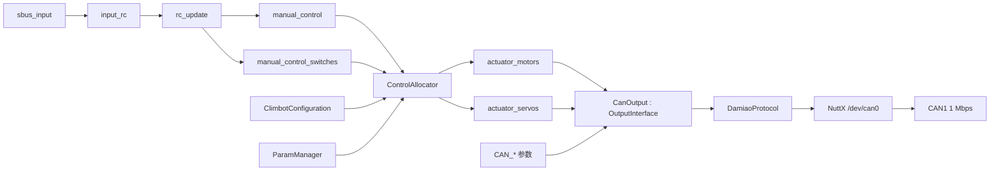

# 第六步：Climbot 执行器分配与 CAN 输出框架

## 1. 设计目标

本步骤只保留四个核心部分：

1. `RobotConfiguration` 描述机器人有多少电机和舵机。
2. `Allocation` 把遥控器语义量分配到 `actuator_motors` 和 `actuator_servos`。
3. `CanOutput` 继承 `OutputInterface`，使用 NuttX `/dev/can0` 下发执行器。
4. `DamiaoProtocol` 只负责达妙协议的 CAN 帧编解码。

电机型号、CAN ID、控制模式、协议和输出范围都由现有参数系统管理。Climbot 的 `.sh`
构型文件使用 `param set-default` 设置本机默认值，用户通过 `param set` 修改后的值不会被
构型脚本覆盖。

## 2. 已完成的遥控器链路

```text
MK32 接收机 SBUS
       ↓
sbus_input
       ↓ input_rc
rc_update
  ├─ MIN/MAX/TRIM/DEADZONE/REV
  ├─ RC_MAP_* 通道映射
  └─ RC lost/failsafe
       ↓
manual_control + manual_control_switches
```

默认左手油门模式已经配置：

```text
CH1 -> roll
CH2 -> pitch
CH3 -> throttle
CH4 -> yaw
CH5..CH16 -> switch1..switch12
```

`manual_control` 已包含归一化后的 `roll/pitch/yaw/throttle`，范围为 `-1..1`；
`manual_control_switches` 已包含 12 路开关状态。因此 Allocation 不接触 SBUS 原始数据。

## 3. 精简后的文件树

```text
msg/
├─ ActuatorMotors.msg            # 归一化动力电机输出
├─ ActuatorServos.msg            # 归一化舵机/转向输出
└─ ActuatorStatus.msg            # CAN 执行器反馈与故障

robot/
├─ configuration/
│  ├─ RobotConfiguration.hpp     # 所有机器人构型的父类
│  ├─ ClimbotConfiguration.hpp   # Climbot 子类
│  └─ ClimbotConfiguration.cpp
│
├─ control/
│  ├─ Allocation.hpp             # 分配算法接口
│  ├─ ClimbotAllocation.hpp      # Climbot 分配算法
│  └─ ClimbotAllocation.cpp
│
├─ output/
│  ├─ OutputInterface.hpp        # 输出驱动父类
│  ├─ CanOutput.hpp              # NuttX CAN 输出模块
│  └─ CanOutput.cpp
│
└─ modules/
   ├─ ControlAllocator.hpp       # ModuleBase 任务
   └─ ControlAllocator.cpp

protocol/can/
├─ CanProtocol.hpp               # 支持的 CAN 协议编号
├─ DamiaoProtocol.hpp            # 达妙帧接口
└─ DamiaoProtocol.cpp            # 达妙帧编解码

apps/cboard/
├─ control_allocator_main.cpp    # control_allocator start|stop|status
└─ can_output_main.cpp           # can_output start|stop|status|protocols|map

startup/etc/robots/
└─ climbot.sh                    # Climbot 默认参数和模块启动

tests/
├─ damiao_protocol_test.cpp
├─ climbot_allocation_test.cpp
└─ step6_can_output.ps1
```

## 4. 数据流



## 5. RobotConfiguration 与 Climbot

`RobotConfiguration` 只统计执行器，不处理 CAN 协议：

```cpp
class RobotConfiguration
{
public:
  virtual ~RobotConfiguration() = default;

  virtual const char *name() const = 0;
  virtual uint8_t motorCount() const = 0;
  virtual uint8_t servoCount() const = 0;
  virtual uint32_t reversibleMotorMask() const = 0;
};
```

Climbot 子类第一版定义：

```cpp
class ClimbotConfiguration final : public RobotConfiguration
{
public:
  const char *name() const override { return "climbot"; }
  uint8_t motorCount() const override { return 2; }
  uint8_t servoCount() const override { return 2; }
  uint32_t reversibleMotorMask() const override { return 0x03; }
};
```

PX4 风格分类按执行器作用区分，而不是按通信硬件区分：

```text
actuator_motors[0] -> 前动力轮，达妙 S3519，速度模式
actuator_motors[1] -> 后动力轮，达妙 S3519，速度模式
actuator_servos[0] -> 前轮转向，达妙 4310，位置速度模式
actuator_servos[1] -> 后轮转向，达妙 4310，位置速度模式
```

4310 在硬件上仍是 CAN 电机，但在控制分配中承担转向，所以归入 `actuator_servos`。

## 6. Allocation

`ControlAllocator` 订阅 `manual_control`，调用当前构型的 `Allocation`，发布两类执行器
topic。第一版 Climbot 默认分配为：

```cpp
motors[0] = throttle * CA_THR_F;
motors[1] = throttle * CA_THR_R;

servos[0] = yaw * CA_YAW_F;
servos[1] = yaw * CA_YAW_R;
```

构型脚本默认值：

```text
CA_THR_F = 1.0    前动力轮参与前进后退
CA_THR_R = 1.0    后动力轮参与前进后退
CA_YAW_F = 1.0    前转向电机参与偏航
CA_YAW_R = 0.0    第一版后转向电机不参与偏航
```

这实现“前后动力轮同时前进后退，当前只调用前轮转向产生偏航”。以后执行：

```sh
param set CA_YAW_R -1
```

即可让后轮反向参与转向；设置为 `1` 则同向参与，不需要修改 Allocation 代码。

输出发布前统一限制在 `-1..1`。`manual_control.valid=false`、RC lost 或急停时，两类
输出立即变为无效，动力输出归零。

## 7. OutputInterface 和 CanOutput

```cpp
enum class ActuatorType : uint8_t
{
  Motor,
  Servo
};

class OutputInterface
{
public:
  virtual ~OutputInterface() = default;
  virtual bool init() = 0;

  virtual bool updateOutputs(ActuatorType type,
                             bool stopMotors,
                             const float *outputs,
                             uint8_t count,
                             uint64_t now) = 0;
};
```

`CanOutput` 是 `OutputInterface` 的子类，并且是唯一访问 `/dev/can0` 的任务：

```cpp
class CanOutput final : public OutputInterface
{
public:
  bool init() override;

  bool updateOutputs(ActuatorType type,
                     bool stopMotors,
                     const float *outputs,
                     uint8_t count,
                     uint64_t now) override;

private:
  int _canFd{-1};
};
```

NuttX BSP 中完成 CAN1 注册：

```text
STM32 CAN1 PD0/PD1
       ↓
stm32_caninitialize(1)
       ↓
can_register("/dev/can0", can)
       ↓
CanOutput open("/dev/can0")
```

不移植官方 STM32 HAL 的 `CAN_HandleTypeDef`、中断回调和 `HAL_Delay`。

## 8. 在 CanOutput 中选择协议

支持协议使用简单枚举：

```cpp
enum class CanProtocol : int32_t
{
  Disabled = 0,
  Damiao = 1
};
```

每次下发时读取已经缓存的参数配置，再调用对应协议：

```cpp
bool CanOutput::sendOne(const CanChannelConfig &config, float output)
{
  switch (config.protocol)
    {
      case CanProtocol::Damiao:
        return sendDamiao(config, output);

      case CanProtocol::Disabled:
      default:
        return true;
    }
}
```

`sendDamiao()` 根据执行器类型和模式调用：

```text
Motor + Velocity
    -> ID = 0x200 + CAN_ID
    -> v_des = output * VMAX

Servo + PositionVelocity
    -> ID = 0x100 + CAN_ID
    -> p_des 在 PMIN..PMAX 内映射
    -> v_des = VMAX
```

`DamiaoProtocol` 只生成或解析 CAN 帧，不打开设备、不创建线程、不访问 uORB。

## 9. CAN 参数

参数名保持在 16 字符以内：

```text
CAN_M0_PROTO    前动力轮协议，0关闭，1达妙
CAN_M0_TYPE     电机型号编号
CAN_M0_ID       接收 ID
CAN_M0_FBID     反馈 ID
CAN_M0_MODE     默认 3，速度模式
CAN_M0_VMAX     最大速度 rad/s
CAN_M0_REV      方向 1/-1

CAN_M1_*        后动力轮

CAN_S0_PROTO    前转向协议
CAN_S0_TYPE     默认 DM4310
CAN_S0_ID       接收 ID
CAN_S0_FBID     反馈 ID
CAN_S0_MODE     默认 2，位置速度模式
CAN_S0_PMIN     机械指令最小位置 rad
CAN_S0_PMAX     机械指令最大位置 rad
CAN_S0_PFBMAX   达妙反馈协议位置量程，按电机手册设置，默认 ±12.5 rad
CAN_S0_VMAX     转向最大速度 rad/s
CAN_S0_REV      方向 1/-1

CAN_S1_*        后转向
```

`CanOutput` 订阅 `parameter_update`。参数变化后刷新缓存，不在每个发送周期按名称搜索
参数。

NSH 查询支持的协议：

```sh
nsh> can_output protocols
0  disabled
1  damiao
```

查询当前映射：

```sh
nsh> can_output map
motor 0: damiao id=1 mode=velocity
motor 1: damiao id=2 mode=velocity
servo 0: damiao id=3 mode=position_velocity
servo 1: damiao id=4 mode=position_velocity
```

选择协议仍通过统一参数系统：

```sh
param set CAN_M0_PROTO 1
param set CAN_M1_PROTO 1
param set CAN_S0_PROTO 1
param set CAN_S1_PROTO 1
```

## 10. Climbot 构型脚本

增加 `/etc/robots/climbot.sh`：

```sh
#! /bin/nsh

# 动力分配默认值
param set-default CA_THR_F 1.0
param set-default CA_THR_R 1.0
param set-default CA_YAW_F 1.0
param set-default CA_YAW_R 0.0

# 两个动力电机：达妙速度模式
param set-default CAN_M0_PROTO 1
param set-default CAN_M0_MODE 3
param set-default CAN_M1_PROTO 1
param set-default CAN_M1_MODE 3

# 两个转向执行器：达妙位置速度模式
param set-default CAN_S0_PROTO 1
param set-default CAN_S0_MODE 2
param set-default CAN_S1_PROTO 1
param set-default CAN_S1_MODE 2

control_allocator start -c climbot
can_output start
```

`param set-default` 需要在现有参数命令中增加。它只改变构型默认值：

- 参数从未被用户修改时，采用脚本默认值。
- 参数已经由 `param set` 保存时，保留用户值。
- 不会在每次启动时覆盖转向零偏、方向、CAN ID 等标定结果。

现阶段 `rcS` 在当前 NSH 中加载构型脚本，避免创建第二个 shell 后重复执行启动流程：

```sh
source /etc/robots/climbot.sh
```

以后有第二种机器人时，再增加另一个 `RobotConfiguration` 子类和对应 `.sh` 文件。

## 11. 实现顺序

1. 给参数系统增加 `param set-default`。
2. 增加 `ActuatorMotors.msg`、`ActuatorServos.msg`、`ActuatorStatus.msg`。
3. 实现 `RobotConfiguration`、`ClimbotConfiguration` 和 Allocation 主机测试。
4. 在 CBoard BSP 中注册 NuttX `/dev/can0`，先完成 CAN 回环测试。
5. 实现 `OutputInterface` 和 `CanOutput`。
6. 移植并测试 `DamiaoProtocol`，先只接一台失能状态电机读取反馈。
7. 完成单台 4310 小角度测试和单台 S3519 低速测试。
8. 最后启用 Climbot 四执行器分配和 RC lost 保护。
